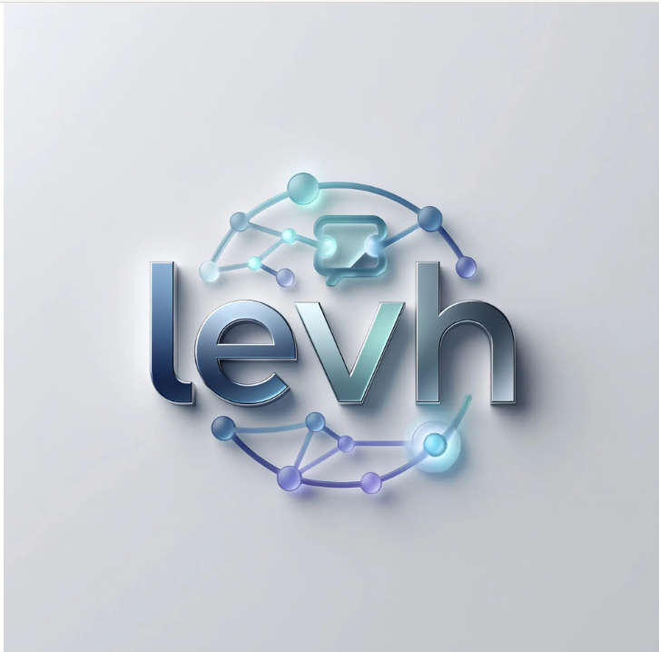

                                                         # LEVH


<p align="center">
  
</p>


<p align="center">
  <strong>LEVH</strong><br>
  Shared Memory Layer for AI Coding Workflows<br>
  <em>Memory that forgets like you do — unless it matters.</em>
</p>

<p align="center">
  
  
  
  
  
  
  
</p>

<p align="center">
  <a href="https://pypi.org/project/levh/"></a>
  <a href="https://ali-ulu.github.io/levh/"></a>
  <a href="https://github.com/ali-ulu/levh/discussions"></a>
</p>

---

## What is LEVH?

LEVH gives your AI coding agents a **persistent, searchable memory** across sessions, projects, and tools. Instead of starting from scratch every time, your AI remembers what you discussed, decisions you made, and context from every workspace.

Most memory tools optimize for **perfect recall** — store everything, retrieve everything, let noise pile up forever. LEVH instead models memory the way **human memory actually works**: every memory has its own decay curve; unused memories fade; memories you actually rely on get reinforced and become durable, automatically, with no manual curation. Signal rises to the top on its own.

It works as an **MCP (Model Context Protocol) server** — plug it into Claude Desktop, Cursor, Claude Code, VS Code (Cline), Windsurf, or any MCP-compatible client. It also exposes a **REST API + WebSocket** for custom integrations and ships with a built-in **dashboard** with a real-time activity feed.

**Key insight**: Your AI tools (Claude, Cursor, Copilot) are stateless. LEVH makes them stateful — and self-curating.

---

## The memory model

This is the core mechanic, not a footnote:

- **Every memory has its own half-life.** New memories start at a default (168h) — like short-term memory, they fade fast unless something happens.
- **Recalling a memory resets its clock and reinforces it.** Each time a memory is retrieved (or explicitly reinforced), its half-life grows — modeled on spaced repetition / the testing effect, the same mechanism flashcard apps like Anki use to build long-term retention.
- **Importance accelerates consolidation**, like emotional salience in human memory: a `0.9`-importance memory becomes durable much faster per recall than a `0.1` one.
- **Outcome feedback closes the loop.** `memory_feedback(helpful=false)` cuts a memory's stability so wrong or stale information fades out fast instead of resurfacing; `helpful=true` reinforces it. Your AI can call this whenever you correct it.
- **New information interferes with old.** Storing a memory near-identical to an existing one weakens the older version (retroactive interference) — "the deploy branch is prod" naturally supersedes "the deploy branch is main" without anyone deleting anything.
- **Pinning is permanent encoding** — for rules and facts that must never be forgotten, skip decay entirely. Pinned memories are also immune to interference and never auto-deduped.
- **Fading memories surface for review.** The dashboard (and the `list_fading_memories` tool) shows memories whose predicted retention has dropped below 35% — rescue what still matters with one click, let the rest go.
- Every memory's curve is visible in the dashboard: open any memory to see its predicted retention over the next 30 days, its current strength, and one-click **Reinforce** / **Stale** actions.

```
retention(t) = 0.5 ^ (hours_since_last_recall / stability_hours)
stability_hours(after recall)     = min(stability × (1 + gain·(0.5+importance)), max_stability)
stability_hours(negative feedback) = max(stability × weaken_factor, 1h)
```

---

## Features

- **Adaptive memory decay**: per-memory half-life, reinforced by recall, weakened by negative feedback and interference, visualized as a forgetting curve — see [The memory model](#the-memory-model)
- **3-Layer Memory**: ShortTerm (FIFO deque, max 50) → Episodic (SQLite) → Vector Store (NumPy cosine similarity)
- **H(x,ψ) Scoring**: Multi-factor ranking: `α·(1-similarity) + β·(1-decay) + γ·(1-importance) + δ·(1-frequency)` — every weight env-configurable, every score explainable in the UI
- **Ask your memory**: `ask_memory` / `POST /api/ask` / dashboard "Ask" panel — a natural-language question returns a synthesized answer that **cites the exact memories** it drew from (with dates). LLM-powered when `OPENAI_API_KEY` is set, deterministic ranked-evidence fallback offline. Read-only: asking never reinforces memories.
- **People graph**: everyone you interact with, extracted automatically from calendar attendees, email senders/recipients, and transcript speakers — `/api/people`, `list_people`/`about_person` MCP tools, and a dashboard **People** page ("what do I know about X?"). No manual tagging.
- **Timeline**: episodic memories grouped by the day they actually happened — "what happened this/last week" — `/api/timeline`, the `timeline` MCP tool, and a dashboard **Timeline** page.
- **Daily Briefing**: memory as an active assistant — today's events, open commitments detected from your own words ("I'll send…", "yapacağım…"), and what you may be forgetting. Fully offline/deterministic (no LLM key). `/api/briefing`, the `briefing` MCP tool, and a dashboard **Briefing** page.
- **Organizations**: the people graph rolled up by email domain — the companies you actually interact with, who from them, and how often. Personal email providers excluded. `/api/organizations`, `list_organizations`/`about_organization` MCP tools, and a dashboard **Organizations** page.
- **Decisions**: decision statements detected from memory content ("we decided", "agreed to", "karar verdik") — what was decided, and when/where. Deterministic, no LLM. `/api/decisions`, the `list_decisions` MCP tool, and a dashboard **Decisions** page.
- **Encrypted Backup & Restore**: full portable snapshot (every memory *with its decay state* + every session), optionally encrypted at rest with a passphrase (PBKDF2 + Fernet/AES). `/api/backup` + `/api/restore`, `create_backup`/`restore_backup` MCP tools, and a Settings → **Backup & Restore** panel with merge/replace.
- **Meeting Prep**: the proactive "before you walk in" brief — your next meeting, who's attending, what you last discussed with each of them, plus relevant open commitments and decisions. Deterministic, offline. `/api/meeting-prep`, the `meeting_prep` MCP tool, and a dashboard **Meeting Prep** page.
- **Memory Consolidation**: sleep-like compression — clusters of related, aged, unpinned memories collapse into one durable summary each (the raw episodes archived inside it, not lost). `/api/memories/consolidate-similar`, the `consolidate_similar` MCP tool, and Settings → Data Management buttons.
- **Spaced-Repetition Review**: the fading queue as an active review flow — keep / reinforce / weaken / pin / snooze / forget each memory losing strength, every decision recorded in its history. Closes the lifecycle loop. `/api/memories/review`, `list_review_memories`/`review_memory` MCP tools, `levh review` CLI, and a dashboard **Review** page.
- **Memory Admission Gate**: decides what happens to an incoming memory *before* it's stored — admit / review / reject (duplicates) / redact (strips secrets like API keys & passwords; keeps emails). Deterministic, offline. `/api/memories/admit` + `/api/memories/evaluate-admission`, `admit_memory`/`evaluate_admission` MCP tools, `levh admit` CLI, and a Settings preview card.
- **Connector Framework v2**: gate-integrated, incremental ingest — every fetched item is routed through the admission gate (dedupe + secret redaction) with per-item error isolation, and each run is recorded so re-syncing is incremental and reportable. `/api/connectors/sync` + `/api/connectors/sync-state`, `sync_connector`/`connector_sync_status` MCP tools, `levh sync` CLI, and a Settings gate toggle + sync history.
- **Hard-delete Audit & Redaction**: deletes a memory from the tracked primary stores and reports any detected residue (`purge_memory`), and finds + strips secrets stored before the gate existed (`audit_secrets` / `redact_secrets`, logged to each memory's redaction history). Full derived-state cascade is verified by the 2.26.x privacy-hardening gates before public RC. `/api/memories/audit-secrets` + `/redact-all` + `/{id}/redact` + `/{id}/purge`, matching MCP tools, `levh audit-secrets`/`redact-secrets`/`purge` CLI, and a Settings **Privacy & Redaction** card.
- **Entity Knowledge Graph**: memories indexed into persistent `entities` + `memory_entities` tables — person / organization / event / document / task — so "which memories mention X" and "which entities co-occur with X" are real joins. `/api/entities` (reindex / stats / list / detail), `reindex_entities`/`list_entities`/`about_entity` MCP tools, `levh entities` CLI, and a dashboard **Graph** page.
- **Provenance / Trust Score**: a deterministic, explainable *reliability* signal per memory — source type + entity-graph corroboration (how many independent sources back it) + review lifecycle + recency − risk flags → a `confidence` with a label and a human-readable breakdown. Separate from the H-score; never changes recall ranking; not a "truth" claim. `/api/memories/{id}/trust` + `/trust/recompute` + `/low-trust`, `memory_trust`/`recompute_trust_scores`/`list_low_trust_memories` MCP tools, `levh trust` CLI, and a Settings **Trust & provenance** card.
- **Conflict Candidates**: deterministic flagging of memories that *might* disagree (share an entity + an opposing surface pattern: antonym / negation / same-attribute-different-value) — a **review signal, never a verdict**, never auto-deletes; an open candidate adds a small risk to the trust score. Not LLM contradiction detection. `/api/conflicts` (detect / list / review), `detect_conflict_candidates`/`list_conflict_candidates`/`review_conflict_candidate` MCP tools, `levh conflicts` CLI, and a dashboard **Conflicts** page.
- **59 MCP Tools**: Store, admit, evaluate-admission, recall, ask, forget, purge, audit-secrets, redact-secrets, search, update, list, stats, consolidate, consolidate-similar, sessions, export/import, backup/restore, connectors, connector-sync, pinning, reinforcement, feedback, fading review, spaced-repetition review, projects, people, organizations, decisions, timeline, briefing, meeting prep, context files, dedupe, related memories, session summarization
- **Auto-Capture Summaries**: `summarize_session` distills a session's memories into one durable memory — LLM-powered when `OPENAI_API_KEY` is set, deterministic offline fallback otherwise; can run automatically on `end_session` (`AUTO_SUMMARIZE_SESSIONS=true`)
- **Related Memories**: live nearest-neighbour "see also" for any memory, computed from embedding similarity — no manual linking, no extra schema
- **Recall Quality Benchmark**: `levh benchmark` / Settings panel reports hit@1/hit@3/hit@5/MRR on a labelled query set, so recall quality is measurable, not just claimed
- **Project Memory**: Namespace memories per repo/workspace; filter recall by project
- **Source Tracking**: Know which AI client (claude-code, cursor, ...) stored each memory
- **Pinned Memories**: Rules and decisions that never decay and always surface
- **Context File Generation**: Compile memories into `CLAUDE.md` / `.cursorrules` so every session starts pre-loaded — from the UI, the CLI, or an MCP tool
- **Auto-Capture**: `levh hook install` captures every git commit message as a memory; `levh capture` for one-liners (auto-detects your repo as the project)
- **4 Embedding Modes**: OpenAI `text-embedding-3-small`, local `all-MiniLM-L6-v2`, **Ollama** (fully offline), or deterministic hash fallback — the system always works
- **App Connectors**: Import from Calendar (.ics), Email (.mbox/.eml), Meeting transcripts (.vtt/.srt), Notion, Obsidian, GitHub repos, local files
- **Live Dashboard**: Next.js dashboard served by the API itself (one process, one port) with a real-time WebSocket activity feed, semantic search, insights charts, and full memory management
- **Zero Infrastructure**: SQLite (no MongoDB, no Redis, no external services); old v1 databases migrate automatically

---

## Quick Start

### 1. Install

```bash
git clone https://github.com/ali-ulu/levh.git
cd levh
pip install -e ".[dev]"
pip install levh
```

### 2. Configure

```bash
cp .env.example .env
# Defaults work out of the box; set EMBEDDER_MODE=local for semantic search
```

### First run: choose demo or real data

**Try the demo**

```bash
pip install levh
levh setup --demo --client claude --profile work
levh serve
```

**Start with real data**

```bash
pip install levh
levh setup --real --client claude --profile work
levh capture "Atlas uses PostgreSQL in production."
levh serve
```

The first-run dashboard offers the same two paths, shows real readiness state,
generates focused MCP configs, and explains the local/off-by-default dogfood
measurement. See [Getting Started](docs/getting-started.md) and the
[5-minute demo](docs/demo/5-minute-demo.md).

### 3. Run

```bash
levh serve            # or: uvicorn server.api:app --port 8000
# Dashboard + API on http://localhost:8000
# MCP SSE stream endpoint: http://localhost:8000/api/mcp/sse
```

The dashboard is served by the API. Source checkouts serve `frontend/out/`; built
wheels include a packaged static export under `server/dashboard/`. To rebuild the
dashboard after changes: `cd frontend && npm ci && npm run build`.

### Try it in 5 minutes

Empty store? Load a deterministic demo corpus — 4 people, 2 organizations, a few
decisions and tasks, meetings, and one real conflict candidate — so every view has
something to show:

```bash
levh seed-demo        # or click "Load demo data" on the empty dashboard
```

Then open the dashboard and explore **Briefing** (daily digest), **Meeting Prep**
(who/what before a call), **Conflicts** (review the disputed Atlas deadline), and
**Insights** (watch low-importance memories fade while pinned ones persist). The
seed refuses to touch a non-empty store unless you pass `--force`.

### 4. Connect Your AI Client

Open **Settings** in the dashboard for copy-paste MCP configs, or see
[Platform Setup](#platform-setup) below.

### 5. (Optional) Auto-capture your work

```bash
levh hook install               # capture every git commit message
levh capture "we use pnpm, not npm" --pin
levh context -o CLAUDE.md       # compile memory into a context file
```

---

## Platform Setup

All clients use the same stdio server. Generate any config with
`levh mcp config <claude|claude_code|cursor|windsurf|vscode|cline>`.

### Claude Desktop

Edit `~/Library/Application Support/Claude/claude_desktop_config.json` (macOS) or `%APPDATA%\Claude\claude_desktop_config.json` (Windows):

```json
{
  "mcpServers": {
    "levh": {
      "command": "python",
      "args": ["-m", "server.mcp_stdio"],
      "cwd": "/path/to/levh-new",
      "env": {
        "EMBEDDER_MODE": "local"
      }
    }
  }
}
```

### Cursor IDE

Same server block in `.cursor/mcp.json` in your project root.

### Claude Code (CLI)

Same server block in `~/.claude.json`.

### VS Code (Cline Extension)

Same server block (under a `servers` key) in `.vscode/mcp.json`.

### Windsurf

Same server block in `~/.codeium/windsurf/mcp_config.json`.

---

## Architecture

```
                    ┌─────────────────────────────────────────────┐
                    │           LEVH Server                │
                    │                                             │
  Claude Desktop ───┤  ┌─────────┐    ┌──────────┐    ┌──────┐   │
  Cursor IDE     ───┤  │   MCP   │    │  Memory  │    │Embed │   │
  Claude Code    ───┤  │ Server  ├───▶│  Engine  ├───▶│OpenAI│   │
  VS Code/Cline  ───┤  │(stdio + │    │ 3-Layer  │    │Local │   │
  Windsurf       ───┤  │  SSE)   │    │ H(x,ψ)   │    │Ollama│   │
                    │  └─────────┘    └────┬─────┘    └──────┘   │
  REST API       ───┤   one shared        │                      │
  WebSocket      ───┤   engine      ┌─────▼──────┐               │
  Dashboard (/)  ───┤   instance    │   SQLite   │               │
                    │               │ (aiosqlite)│               │
  ─────────────────┤               └────────────┘               │
  App Connectors:   │                                            │
  Notion / Obsidian │  import_from_app() → store → recall        │
  GitHub / Files ───┤                                            │
                    └─────────────────────────────────────────────┘
```

All transports share **one engine instance** — a memory stored via MCP is
instantly visible in the dashboard's live feed, and vice versa.

---

## 59 MCP Tools

> **Tool profiles.** Advertising all 59 tools to a client hurts tool-selection
> accuracy, so LEVH groups them into cumulative profiles —
> `minimal` (5) ⊂ `work` (15) ⊂ `admin` (54) ⊂ `full` (59). Generated configs
> default to **`work`**; run `levh mcp profiles` to see the bands, or set
> `LEVH_MCP_PROFILE` / `mcp config --profile <name>` to change it. The
> full table below is the `full` surface. Profiles only filter which tools a
> client sees — they are **not** an authentication or authorization boundary;
> every profile talks to the same engine instance with the same access.

| # | Tool | Description |
|---|------|-------------|
| 1 | `store_memory` | Store a memory with importance, tags, project, source, pin |
| 2 | `recall_memory` | Recall memories ranked by H(x,ψ) score (filter by session/project) |
| 3 | `forget_memory` | Delete from all 3 layers |
| 4 | `search_memory` | Semantic search with detailed results |
| 5 | `update_memory` | Update content/importance/tags |
| 6 | `list_memories` | List with type/tag/session/project/source/pinned filters |
| 7 | `get_memory_stats` | System statistics and metrics |
| 8 | `consolidate_memories` | Promote short-term → episodic |
| 9 | `clear_short_term` | Clear the live FIFO deque |
| 10 | `set_importance` | Set importance (0.0-1.0) |
| 11 | `get_context` | Build context window (short-term + pinned + important) |
| 12 | `create_session` | Start a named session |
| 13 | `end_session` | End session + consolidate its memories |
| 14 | `export_memories` | Export all memories as JSON |
| 15 | `import_memories` | Import memories from JSON |
| 16 | `import_from_app` | Import from Calendar/Email/Transcripts/Notion/Obsidian/GitHub/local files |
| 17 | `list_connectors` | List available app connectors |
| 18 | `get_connector_help` | Get config help for a connector |
| 19 | `pin_memory` | Pin a memory — exempt from decay, always in context files |
| 20 | `unpin_memory` | Restore normal decay |
| 21 | `list_projects` | Workspaces with memory counts |
| 22 | `list_sources` | Which AI clients stored memories |
| 23 | `generate_context_file` | Compile memories into CLAUDE.md / .cursorrules |
| 24 | `dedupe_memories` | Find/remove near-duplicates (dry-run by default) |
| 25 | `reinforce_memory` | Manually strengthen a memory — resets decay clock, grows stability |
| 26 | `memory_feedback` | helpful=true reinforces; helpful=false makes wrong/stale info fade fast |
| 27 | `list_fading_memories` | Review queue of memories about to be forgotten |
| 28 | `related_memories` | Nearest-neighbour "see also" for a memory (live, embedding-based) |
| 29 | `summarize_session` | Distill a session's memories into one durable summary memory |
| 30 | `ask_memory` | Ask your memory a question → synthesized, cited answer (read-only) |
| 31 | `list_people` | People across your memories (calendar/email/transcript), by frequency |
| 32 | `about_person` | One person's profile + the memories mentioning them |
| 33 | `timeline` | Recent memories grouped by day (what happened this/last week) |
| 34 | `briefing` | Daily briefing — today's events, open commitments, and what you may be forgetting |
| 35 | `list_organizations` | Organizations across your memories (people grouped by email domain) |
| 36 | `about_organization` | One organization's profile + the memories mentioning it |
| 37 | `list_decisions` | Decisions detected in recent memories — what was decided, when/where |
| 38 | `create_backup` | Write a full backup (memories + sessions) to a file, optionally passphrase-encrypted |
| 39 | `restore_backup` | Restore memories + sessions from a backup file (merge or replace) |
| 40 | `meeting_prep` | Pre-meeting brief — next meeting, attendees, what you last discussed, open items |
| 41 | `consolidate_similar` | Compress clusters of related aged memories into durable summaries (sleep-like) |
| 42 | `list_review_memories` | Memories due for spaced-repetition review (fading, unpinned, un-snoozed) |
| 43 | `review_memory` | Apply a review decision — keep / reinforce / weaken / pin / forget / snooze |
| 44 | `evaluate_admission` | Preview the admission verdict for candidate text (admit/review/reject/redact) |
| 45 | `admit_memory` | Store through the admission gate — dedupe + secret redaction |
| 46 | `sync_connector` | Connector v2 — fetch + gate-filtered incremental ingest |
| 47 | `connector_sync_status` | Per-source sync bookkeeping (last synced, totals, run count) |
| 48 | `audit_secrets` | Scan stored memories for secrets (credentials, tokens) |
| 49 | `redact_secrets` | Strip secrets from stored memories (preview or apply) |
| 50 | `purge_memory` | Hard-delete a memory and report residue across tracked storage layers |
| 51 | `reindex_entities` | Rebuild the persistent entity graph from all memories |
| 52 | `list_entities` | List graph entities by type, most-mentioned first |
| 53 | `about_entity` | One entity's profile — its memories and co-occurring entities |
| 54 | `memory_trust` | A memory's provenance/trust breakdown (confidence + explainable evidence) |
| 55 | `recompute_trust_scores` | Recompute provenance/trust scores for all memories |
| 56 | `list_low_trust_memories` | Memories below a confidence threshold, least-trusted first |
| 57 | `detect_conflict_candidates` | Flag memory pairs that might disagree (shared entity + opposing pattern) |
| 58 | `list_conflict_candidates` | List conflict candidates by status (open/confirmed/…) |
| 59 | `review_conflict_candidate` | Human review — dismiss / confirm / keep-A / keep-B / both-valid |

---

## CLI

```bash
levh serve                     # API + dashboard on :8000
levh doctor                    # health checks
levh setup --status            # computed first-run readiness
levh setup --demo --client claude --profile work
levh setup --real --client cursor --profile minimal
levh seed-demo                 # load a demo corpus into an empty store
levh capture "note" --pin      # store a memory (auto-detects git repo as project)
levh context -o CLAUDE.md      # generate a context file from memories
levh hook install              # git post-commit auto-capture
levh summarize <session_id>    # distill a session into one summary memory
levh benchmark                 # recall-quality harness (hit@k / MRR)
levh mcp config cursor         # print MCP config for a client
levh mcp stdio                 # run the MCP stdio server
levh eval run                  # golden-fixture memory evaluation → eval_report.json
levh eval report               # print the last written evaluation report
levh dogfood status            # aggregate view of the local usage journal
levh dogfood export -o out.json  # write the aggregate dogfood report (explicit)
```

---

## H(x,ψ) Scoring Algorithm

Memories are ranked by a multi-factor score (lower = more relevant):

```
H(x,ψ) = α·(1-similarity) + β·(1-decay_factor) + γ·(1-importance) + δ·(1-frequency)

α = 0.4  (semantic relevance)      — HSCORE_ALPHA
β = 0.2  (time decay)              — HSCORE_BETA
γ = 0.3  (user-marked importance)  — HSCORE_GAMMA
δ = 0.1  (access frequency)        — HSCORE_DELTA
```

- **Similarity**: Cosine similarity between query and memory embeddings
- **Decay**: Exponential decay measured from **last access** (not creation) at the memory's own `stability_hours` half-life — default 168h, but it grows every time the memory is recalled or reinforced (see [The memory model](#the-memory-model)). **Pinned memories never decay.**
- **Importance**: User-assigned importance (0.0-1.0) — also accelerates stability growth on reinforcement
- **Frequency**: How often the memory has been accessed — only memories actually returned by a recall are counted
- **Explainability**: every score can be broken into its four components — in the dashboard's detail drawer or via `GET /api/memories/{id}/score-breakdown`; the forgetting curve itself is available via `GET /api/memories/{id}/forgetting-curve`

---

## REST API Endpoints

| Method | Endpoint | Description |
|--------|----------|-------------|
| POST | `/api/memories` | Store a memory |
| GET | `/api/memories` | List with filters (`q`, `project`, `source`, `tag`, `pinned`, ...) |
| GET | `/api/memories/{id}` | Get single memory |
| PUT | `/api/memories/{id}` | Update memory |
| PATCH | `/api/memories/{id}/pin` | Pin / unpin |
| POST | `/api/memories/{id}/reinforce` | Manually strengthen a memory |
| POST | `/api/memories/{id}/feedback` | helpful=true/false — learn from recall outcomes |
| GET | `/api/memories/fading` | Memories about to be forgotten (review queue) |
| DELETE | `/api/memories/{id}` | Delete memory |
| POST | `/api/memories/recall` | Recall by query (optional project filter) |
| POST | `/api/memories/consolidate` | Short-term → episodic |
| POST | `/api/memories/dedupe` | Find or remove near-duplicates |
| POST | `/api/memories/export` | Export all as JSON |
| POST | `/api/memories/import` | Import from JSON |
| GET | `/api/memories/{id}/score-breakdown` | Explain a memory's H(x,ψ) score |
| GET | `/api/memories/{id}/forgetting-curve` | Predicted retention curve over time |
| GET | `/api/memories/{id}/related` | Nearest-neighbour "see also" memories |
| POST | `/api/sessions` | Create session |
| GET | `/api/sessions` | List sessions |
| GET | `/api/sessions/{id}` | Get session |
| PATCH | `/api/sessions/{id}/end` | End session (consolidates) |
| POST | `/api/sessions/{id}/summarize` | Distill a session into one summary memory |
| GET | `/api/projects` | Projects with counts |
| GET | `/api/sources` | AI clients with counts |
| GET | `/api/tags` | Tags with counts |
| GET | `/api/people` | People across memories, by frequency |
| GET | `/api/people/{key}` | A person's profile + their memories |
| GET | `/api/timeline` | Memories grouped by day |
| GET | `/api/context` | Current context window |
| POST | `/api/context-file` | Generate CLAUDE.md / .cursorrules |
| GET | `/api/stats` | System statistics |
| GET | `/api/config` | Server configuration |
| GET | `/api/health` | Health check |
| POST | `/api/benchmark/recall` | Run the recall-quality benchmark (hit@k / MRR) |
| WS | `/ws/memory` | Real-time event stream + RPC actions |
| SSE | `/api/mcp/sse` | MCP SSE stream endpoint |
| POST | `/api/connectors/import` | Import from app |
| GET | `/api/connectors` | List connectors |
| GET | `/api/connectors/{name}/config` | Connector config help |

---

## App Connectors

Import data from your existing tools directly into LEVH's memory layer.
Every import can be namespaced under a project.

```python
import_from_app("calendar",    config={"ics_path": "/path/to/calendar.ics"})   # or ics_url
import_from_app("email",       config={"mbox_path": "/path/to/mail.mbox"})     # or eml_path / eml_dir
import_from_app("transcript",  config={"transcript_path": "/path/to/meeting.vtt"})  # or transcript_dir
import_from_app("notion",      config={"api_key": "ntn_xxx", "database_ids": ["..."]})
import_from_app("obsidian",    config={"vault_path": "/path/to/vault"})
import_from_app("github",      config={"token": "ghp_xxx", "repos": ["owner/repo"]})
import_from_app("local_files", config={"directory": "/path/to/project"})
```

**Calendar, Email & Transcripts — the work-life capture trio** (roadmap Phase 1):
*when/who* + *correspondence* + *what was said*. All parse the universal *offline*
export formats with zero extra dependencies, so no OAuth, no API keys, nothing leaves
your machine:

- **Calendar** (`.ics`): the format Google Calendar, Outlook, and Apple Calendar all
  export. Each event → a memory with title, time, attendees, and location — so you can
  ask *"what did I discuss with X last week?"*. Optional `past_days`/`future_days` window.
- **Email** (`.mbox` / `.eml`): Gmail Takeout, Thunderbird, Apple Mail, Outlook export.
  Each message → a memory with sender, recipients, subject, date, and a body excerpt —
  ask *"what did Dana email me about pricing?"*. Options: `past_days`, `max_messages`,
  `body_chars`, `exclude_senders` (skip no-reply/notification noise).
- **Transcripts** (`.vtt` / `.srt` / `.txt`): Zoom, Google Meet, Teams, Otter, Fireflies,
  or Whisper output. Each meeting → one **summarized** memory (LLM if `OPENAI_API_KEY` is
  set, offline extractive otherwise) with the speaker list and a transcript excerpt — ask
  *"what did we decide in the roadmap call?"*. Options: `summarize`, `max_chars`.

Or use the **Import from Apps** panel in the dashboard's Settings page.

---

## Docker

```bash
docker compose up -d
# Dashboard + API: http://localhost:8000
# MCP SSE stream: http://localhost:8000/api/mcp/sse
```

One container, one port. The image builds the dashboard and serves it from the API.

---

## Configuration

Runtime settings use one precedence order across CLI, API, MCP and generated
client configs:

```text
explicit CLI/API override > environment > .stackmemory/config.json > defaults
```

`levh init` and `levh setup` create `.stackmemory/config.json`.
Relative database paths in that file are resolved from the working directory.
LEVH does not load `.env` implicitly; export environment variables in
the process that launches it when environment overrides are required.

| Variable | Default | Description |
|----------|---------|-------------|
| `SQLITE_DB_PATH` | `./stackmemory.db` | SQLite database path |
| `EMBEDDER_MODE` | `auto` | `auto`, `local`, `openai`, `ollama`, `hash`; `auto` is local-first and never selects OpenAI just because a key exists |
| `OPENAI_API_KEY` | — | Used only when `EMBEDDER_MODE=openai` (and separately by optional LLM summaries/Ask features) |
| `LOCAL_MODEL` | `all-MiniLM-L6-v2` | Local embedding model |
| `OLLAMA_URL` | `http://localhost:11434` | Ollama server (mode `ollama`) |
| `OLLAMA_MODEL` | `nomic-embed-text` | Ollama embedding model |
| `SHORT_TERM_MAX` | `50` | Max short-term memories |
| `DECAY_HALF_LIFE_HOURS` | `168` | Starting half-life for new memories |
| `HSCORE_ALPHA` | `0.4` | Similarity weight |
| `HSCORE_BETA` | `0.2` | Decay weight |
| `HSCORE_GAMMA` | `0.3` | Importance weight |
| `HSCORE_DELTA` | `0.1` | Frequency weight |
| `REINFORCEMENT_GAIN` | `0.5` | Stability growth per recall (higher = faster consolidation) |
| `MAX_STABILITY_HOURS` | `8760` | Cap on how durable a memory can become (1 year) |
| `FEEDBACK_WEAKEN_FACTOR` | `0.5` | Stability multiplier on negative feedback |
| `INTERFERENCE_THRESHOLD` | `0.97` | Similarity above which new memories weaken old ones (1.0 = off) |
| `INTERFERENCE_FACTOR` | `0.6` | Stability multiplier applied to superseded memories |
| `AUTO_SUMMARIZE_SESSIONS` | `false` | Auto-summarize a session's memories on `end_session` |
| `SUMMARY_MODEL` | `gpt-4o-mini` | OpenAI chat model used for session summaries |
| `LEVH_TOKEN` | — | Optional shared-secret gate on `/api/*` (except `/api/health`) and the WebSocket |
| `LEVH_CORS_ORIGINS` | localhost only | Comma-separated allowed browser origins (`*` for wildcard) |
| `LEVH_AUTH_RATE_LIMIT` | `10` | Failed token attempts allowed per rate-limit window, per client/process |
| `LEVH_API_RATE_LIMIT` | `120` | Authenticated API requests allowed per window, per client/process |
| `LEVH_RATE_LIMIT_WINDOW_SECONDS` | `60` | In-process rate-limit window; not a distributed quota system |
| `LEVH_SQLITE_BUSY_TIMEOUT_MS` | `5000` | SQLite lock wait before failing; file databases use WAL mode |
| `LEVH_SAFETY_BACKUP_DIR` | DB sibling `safety-backups/` | Location for automatic pre-replace SQLite safety backups |

---

## Security

LEVH binds to loopback by default. `levh serve --host 0.0.0.0`
(or any non-loopback host) is refused unless `LEVH_TOKEN` is set. The
Docker Compose default publishes only `127.0.0.1:8000`; deployments that widen
the bind must set a strong token. CORS is not an authorization boundary.

The default REST, WebSocket, MCP `store_memory`, CLI `capture`, and connector
import paths pass through the deterministic admission gate before persistence.
Rejected/review candidates are not stored; secrets are redacted. An explicit
`admit_memory(force=true)` operation is the audited administrative override.


LEVH is designed as a **local, single-user tool** — no accounts, no
multi-tenancy. Two lightweight controls harden the default local deployment:

- **CORS defaults to localhost origins**, not `*` — without this, any website
  open in your browser could `fetch()` your entire memory store from a
  service running on `localhost:8000`. Widen it with `LEVH_CORS_ORIGINS`
  only if you know what you're exposing.
- **Optional shared-secret token** (`LEVH_TOKEN`) gates every `/api/*`
  route and the WebSocket behind an `X-LEVH-Token` header (or `?token=`
  for the socket). When enabled, failed token attempts and authenticated API
  traffic are limited in-process. Unset by default so local use stays zero-config.

This is not per-user auth or a substitute for running behind your own
reverse proxy if you expose the service beyond localhost.

SQLite file databases use WAL mode, a 5-second busy timeout, numbered
`PRAGMA user_version` migrations, and an FTS5 text index when the local SQLite
build supports it. Full-text search falls back to `LIKE` if FTS5 is unavailable.
Before `restore --replace` changes an existing file database, LEVH creates
a consistent online SQLite safety backup in a local `safety-backups/` directory.

---

## Evaluation & Dogfood (2.25)

Two offline tools for judging whether the memory system is actually working,
distinct from the H(x,ψ) recall benchmark above.

- **`levh eval run [--fixtures DIR] [--embedder-mode hash|local|...] [--output FILE]`**
  runs the golden-fixture evaluation (`tests/fixtures/evaluation/*.json`)
  through the real admission → store → trust → conflict → recall → review
  pipeline and writes a JSON report (default `eval_report.json`). Deterministic
  for a fixed fixture set + embedder mode.
- **`levh eval report [--output FILE]`** prints the last written report.
- **`levh dogfood status`** prints the aggregate view of the local
  usage journal (event counts, time-to-first-value, recall-feedback rate,
  review distribution).
- **`levh dogfood export --output report.json`** is an explicit user
  action that writes the *aggregate* journal report to a file.

Live instrumentation (2.25.1) is **opt-in**: set
`LEVH_DOGFOOD_ENABLED=true` and every transport that uses the shared
engine (REST API / `serve`, MCP stdio, MCP SSE) journals coarse usage events
automatically — store, recall, briefing opened, meeting prep opened, trust
viewed, review keep/reinforce/weaken/forget, conflict confirm/dismiss, seed
demo completed. The journal is a plain JSONL file next to the SQLite database
(override with `DOGFOOD_JOURNAL_PATH`). With the flag unset (the default)
nothing is journaled at all.

Privacy rules, both tools:

- **Local-only, no network.** Neither module performs any network I/O; the
  evaluation report and the dogfood journal are plain local files.
- **No default telemetry.** Nothing is collected or sent anywhere unless the
  user explicitly sets `LEVH_DOGFOOD_ENABLED=true`; there is no
  opt-out because there's no opt-in by default.
- **No raw memory content.** The evaluation report contains fixture keys,
  scenario names, labels, and numbers only. The dogfood journal accepts only
  a whitelisted set of event types and scalar attributes (ids, counts,
  labels) — content and query text are rejected at the API boundary, not
  filtered after the fact.
- **Export is explicit.** `dogfood export` writes aggregates, never raw event
  lines; you decide if and when a report leaves the machine.

Do not quote evaluation numbers (hit@1, hit@3, MRR, precision/recall, etc.)
from anything other than a real `levh eval run` against a known
fixture set — every report is tagged with its `evaluation_version`
(currently `memory-eval-v1`) so a number is only meaningful alongside the
fixture set that produced it.

---

## Testing

```bash
pip install -e ".[dev]"
EMBEDDER_MODE=hash python -m pytest -q
```

**125 tests** covering memory lifecycle, H(x,ψ) scoring, adaptive decay/reinforcement,
outcome feedback, retroactive interference, fading review queue, forgetting curves,
sessions, consolidation, export/import, concurrent operations, edge cases, session
isolation, project namespacing, source tracking, pinning,
recall correctness (no side effects on
non-returned candidates), env-configurable weights, mixed embedding dimensions,
v1 → v2 schema migration, dedupe, context file generation, related memories,
session summarization, the recall-quality benchmark harness, and the REST API.

Benchmark recall quality directly with `levh benchmark`. Source-tree users
can also run `python scripts/benchmark_recall.py`; the runtime implementation is
packaged under `server.core.benchmark` so wheel installs do not depend on the
non-package `scripts/` directory. Run with `EMBEDDER_MODE=local`, `ollama`, or
`openai` for a meaningful semantic signal; the default `hash` embedder is
non-semantic and intended for deterministic smoke checks.

---

## Tech Stack

| Component | Technology |
|-----------|-----------|
| MCP Server | Python `mcp` SDK + `FastMCP` |
| API | FastAPI + Uvicorn |
| Database | SQLite via `aiosqlite` (auto-migrating schema) |
| Embeddings | OpenAI / sentence-transformers / Ollama / hash |
| Vector Search | NumPy cosine similarity |
| Frontend | Next.js 14 (static export) + shadcn/ui + Recharts |
| Container | Docker (single image: API + dashboard) |

---

## License

GNU Affero General Public License v3.0 or later (AGPL-3.0-or-later)
