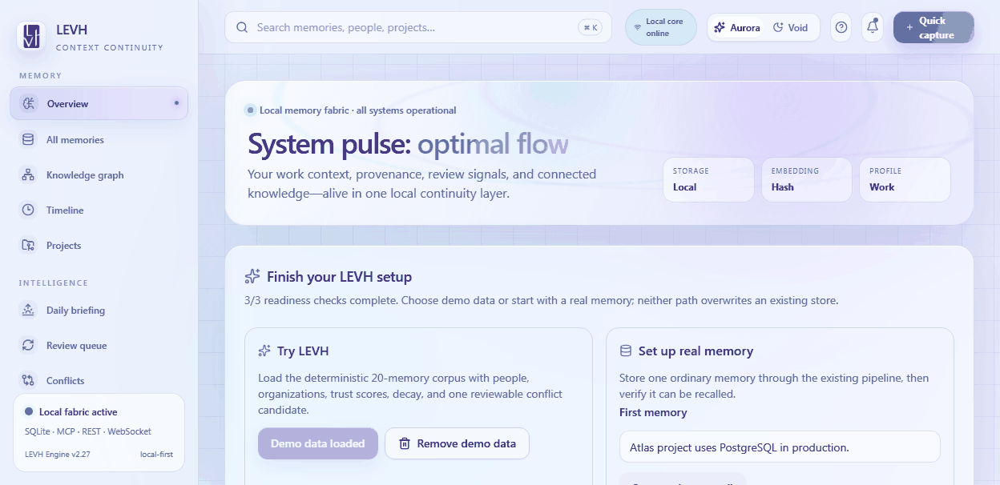

<p align="center">
  
</p>

<p align="center">
  <strong>LEVH</strong><br>
  Local-first memory layer for AI agents and humans<br>
  <em>Memory that forgets like you do — unless it matters.</em>
</p>

<p align="center">
  <a href="https://pypi.org/project/levh/"></a>
  
  
  
  <a href="https://levh.ai-ulu.com/"></a>
</p>

<p align="center">
  <a href="docs/demo/5-minute-demo.md"></a>
</p>

---

## What is LEVH?

Your AI tools are stateless. Every session starts from zero.

LEVH gives them a **persistent, searchable memory** that lives on your machine — plug it into Claude Desktop, Cursor, Claude Code, VS Code, or any MCP client and it remembers your decisions, your projects, and your people across sessions.

Most memory tools optimize for perfect recall: store everything, retrieve everything, let the noise pile up. **LEVH forgets on purpose.** Every memory has its own decay curve; unused memories fade; the ones you actually rely on get reinforced automatically. Signal rises to the top without manual curation.

Everything runs locally on SQLite. No accounts, no cloud, no external services.

---

## How memory works here

This is the core mechanic, not a footnote:

- **Every memory has its own half-life.** New memories start at 168h and fade fast unless something happens.
- **Recall reinforces.** Retrieving a memory resets its clock and grows its half-life — the same spaced-repetition effect Anki uses.
- **Importance accelerates it.** A `0.9`-importance memory consolidates far faster per recall than a `0.1` one.
- **Feedback closes the loop.** Mark a memory unhelpful and its stability drops, so stale information fades instead of resurfacing.
- **New information interferes with old.** "The deploy branch is prod" naturally supersedes "the deploy branch is main" — no one has to delete anything.
- **Pinning is permanent.** Rules and facts that must never be forgotten skip decay entirely.
- **Fading memories surface for review** — rescue what still matters with one click, let the rest go.

```
retention(t) = 0.5 ^ (hours_since_last_recall / stability_hours)
```

Memories are ranked by an explainable multi-factor score, `H(x,ψ)` — semantic similarity, decay, importance and access frequency, each weight configurable and every score breakable into its components in the UI. See [Architecture](docs/ARCHITECTURE.md).

---

## Quick Start

```bash
pip install levh
levh setup --demo --client claude --profile work
levh serve
```

Dashboard and API come up on <http://localhost:8000>. `--demo` loads a small
deterministic corpus — people, organizations, decisions, and one real conflict
candidate — so every view has something to show.

Starting with your own data instead:

```bash
pip install levh
levh setup --real --client claude --profile work
levh capture "Atlas uses PostgreSQL in production."
levh serve
```

Then open **Settings** in the dashboard for copy-paste MCP configs, or run
`levh mcp config cursor` for any supported client.

Optional, once you are set up:

```bash
levh hook install               # capture every git commit message
levh context -o CLAUDE.md       # compile memory into a context file
```

→ [Getting Started](docs/getting-started.md) · [5-minute demo](docs/demo/5-minute-demo.md) · [Installing from source](docs/installation.md)

---

## What you get

- **Adaptive decay** — per-memory half-life, reinforced by recall, weakened by negative feedback, visualized as a forgetting curve.
- **Ask your memory** — natural-language questions return an answer that cites the exact memories it drew from. Deterministic and offline by default.
- **People, organizations & timeline** — who you interact with and what happened when, extracted automatically from calendars, email and transcripts. No manual tagging.
- **Daily briefing & meeting prep** — today's events, open commitments detected from your own words, and who you're about to meet. Fully offline.
- **Decisions & conflicts** — decision statements pulled out of your memories, and a review signal when two memories appear to disagree. A signal, never a verdict; nothing is auto-deleted.
- **Admission gate** — every incoming memory is screened before storage: duplicates rejected, secrets like API keys redacted. Deterministic, offline.
- **Trust & provenance** — an explainable reliability score per memory from source type, corroboration and review history. Separate from ranking; not a truth claim.
- **Entity knowledge graph** — memories indexed into real entity tables, so "which memories mention X" is a join, not a search.
- **Encrypted backup & restore** — a full portable snapshot including decay state, optionally encrypted with a passphrase (PBKDF2 + AES).
- **Consolidation & review** — aged clusters collapse into durable summaries; the fading queue becomes a keep / reinforce / forget flow.
- **59 MCP tools**, a REST API, a WebSocket feed, and a live Next.js dashboard served by the API itself — one process, one port.
- **4 embedding modes** — OpenAI, local `all-MiniLM-L6-v2`, Ollama (fully offline), or a deterministic hash fallback. The system always works.
- **Connectors** for Calendar, Email, transcripts, Notion, Obsidian, GitHub and local files — all routed through the admission gate.

→ [Full MCP tool list](docs/mcp-tools.md) · [REST API](docs/api-reference.md) · [CLI](docs/cli.md) · [Connectors](docs/connectors.md)

---

## Documentation

| | |
|---|---|
| [Getting Started](docs/getting-started.md) | First run, demo vs. real data |
| [Platform Setup](docs/mcp-client-config.md) | Claude Desktop, Cursor, Claude Code, VS Code, Windsurf |
| [Configuration](docs/configuration.md) | Environment variables, precedence, Docker |
| [Architecture](docs/ARCHITECTURE.md) | Layers, engine, scoring internals |
| [MCP Tools](docs/mcp-tools.md) | All 59 tools and the profile bands |
| [REST API](docs/api-reference.md) | Every endpoint |
| [CLI](docs/cli.md) | Every command |
| [Evaluation](docs/memory-evaluation.md) | Recall benchmark, golden fixtures, dogfood |
| [Testing](docs/testing.md) | Running the suite |

---

## Measuring recall quality

Recall quality is measured, not claimed:

```bash
levh benchmark     # hit@1 / hit@3 / hit@5 / MRR on a labelled query set
levh eval run      # golden-fixture run through the full pipeline
```

Please don't quote hit@k or MRR numbers from anywhere other than a real run on
your own corpus and embedder mode — the hash fallback is non-semantic and will
understate quality. → [Evaluation](docs/memory-evaluation.md)

---

## Security

LEVH is a **local, single-user tool** — no accounts, no multi-tenancy.

- **Binds to loopback by default.** A non-loopback bind is refused unless `LEVH_TOKEN` is set. Docker Compose publishes only `127.0.0.1:8000`.
- **CORS defaults to localhost origins**, not `*` — otherwise any site open in your browser could read your entire memory store.
- **Optional shared-secret token** (`LEVH_TOKEN`) gates `/api/*` and the WebSocket, with in-process rate limiting on failed attempts.
- **Secrets are redacted** by the admission gate before storage, and `audit-secrets` / `redact-secrets` find and strip anything stored before the gate existed.

This is not per-user auth, and it is not a substitute for your own reverse proxy
if you expose the service beyond localhost.

**Known limitation:** LEVH keeps its vector cache in-process. If two processes
(for example Claude Desktop and the dashboard) write to the same database
concurrently, each sees the other's changes only after a restart. Cross-process
cache invalidation is tracked for an upcoming release.

Found a vulnerability? See [SECURITY.md](SECURITY.md).

---

## Tech Stack

| Component | Technology |
|-----------|-----------|
| MCP Server | Python `mcp` SDK + `FastMCP` |
| API | FastAPI + Uvicorn |
| Database | SQLite via `aiosqlite` (auto-migrating schema) |
| Embeddings | OpenAI / sentence-transformers / Ollama / hash |
| Vector Search | NumPy cosine similarity |
| Frontend | Next.js 15 + React 19 (static export) + shadcn/ui + Recharts |
| Container | Docker (single image: API + dashboard) |

---

## Contributing

Issues and pull requests are welcome — see [CONTRIBUTING.md](CONTRIBUTING.md)
and [Discussions](https://github.com/ali-ulu/levh/discussions).

## License

GNU Affero General Public License v3.0 or later (AGPL-3.0-or-later).
